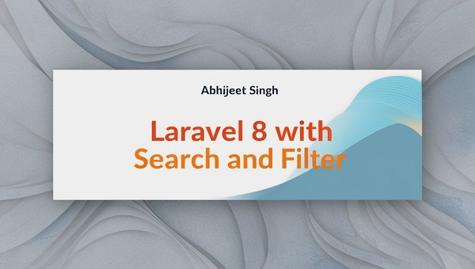

## Screenshot



# Laravel Simple Search and Category Filter
This Laravel 8 application provides a user-friendly interface for searching and filtering items based on categories. It enables users to easily find specific items through a straightforward search bar and refine their results using category filters. This README provides instructions on how to clone the project and run it locally using XAMPP or WAMP.


## Table of Contents

- [Prerequisites](#prerequisites)
- [Cloning the Project](#cloning-the-project)
- [Setting Up the Environment](#setting-up-the-environment)
- [Running the Application](#running-the-application)
- [Usage](#usage)
- [License](#license)

## Prerequisites

Before you begin, ensure you have met the following requirements:

- PHP >= 7.3
- Composer installed on your machine
- XAMPP or WAMP installed
- MySQL or MariaDB

## Cloning the Project

1. Open your terminal (Command Prompt, Git Bash, etc.).
2. Navigate to your desired directory.
3. Run the following command to clone the repository:
```bash
   git clone https://github.com/your-username/your-repo-name.git
```
4. Navigate into the cloned project directory:
```bash
   cd laravel-with-search-and-filter
```

---

## Setting Up the Environment

1. Install Dependencies: Make sure you have Composer installed. Run the following command to install the project's dependencies:
```bash
   composer install
```
2. Generate Application Key:
```bash
   php artisan key:generate
```
3. Run the migrations to set up the database tables:
```bash
   php artisan migrate
```

---

## (Important) Import Database data

1. Go to phpmyadmin:
```bash
   http://localhost/phpmyadmin
```
2. Click on Import:
3. Choose File in:
```bash
   cd ./quicklly/database/_115quicklly.sql
```
3. Click on Go button:

---

## Running the Application
1. Start your XAMPP or WAMP server and ensure the Apache and MySQL services are running.
2. Copy this link past and let's go.
```bash
   http://localhost/quicklly/
```
